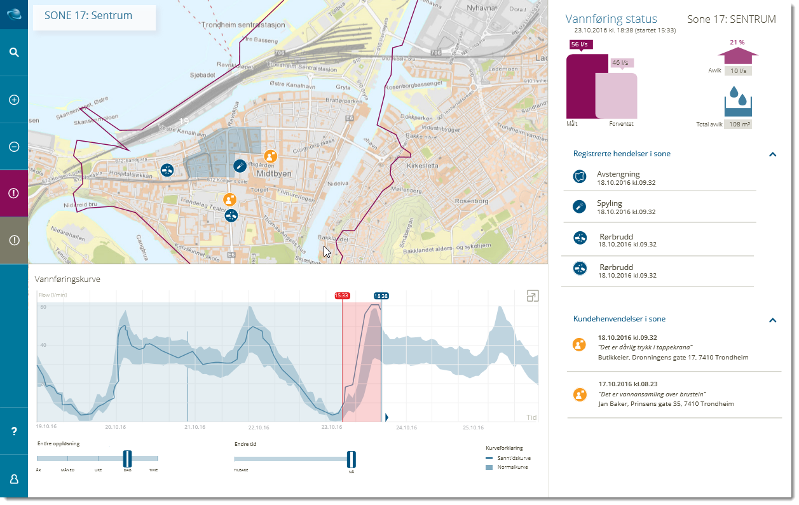
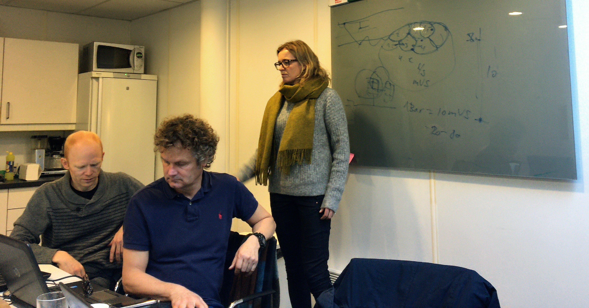
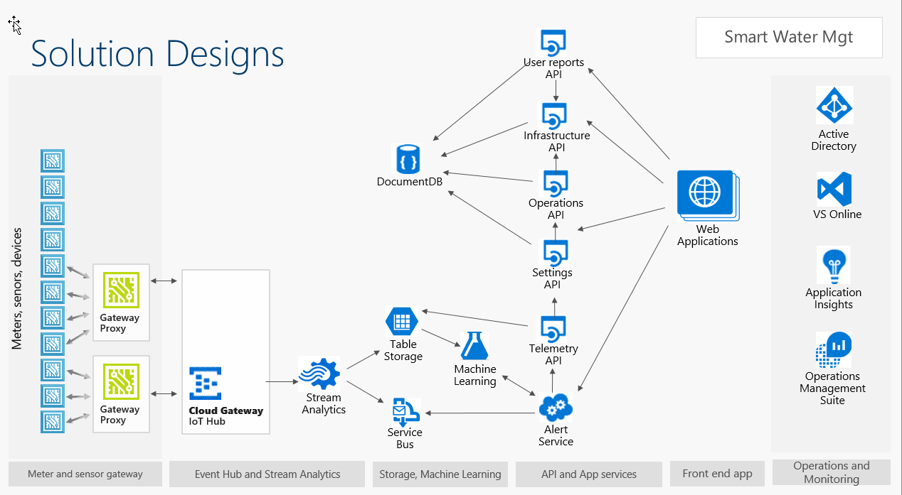
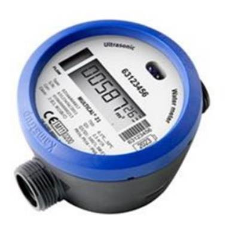
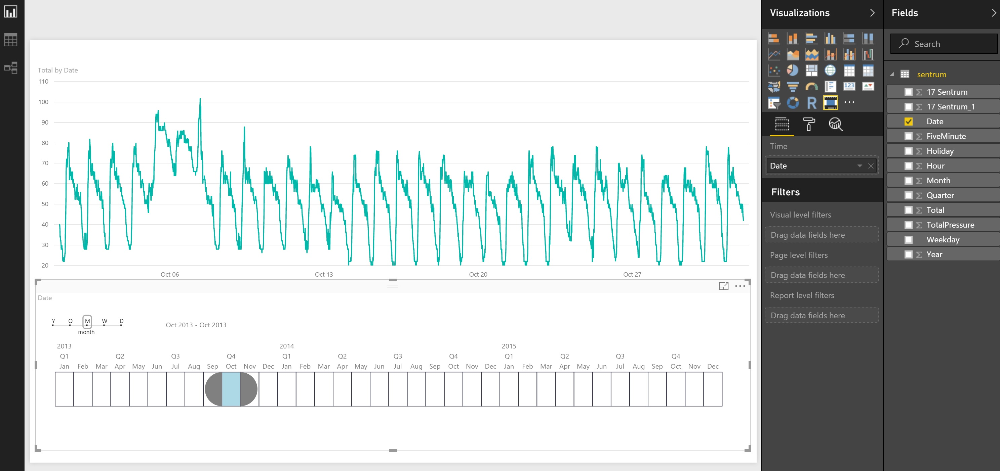
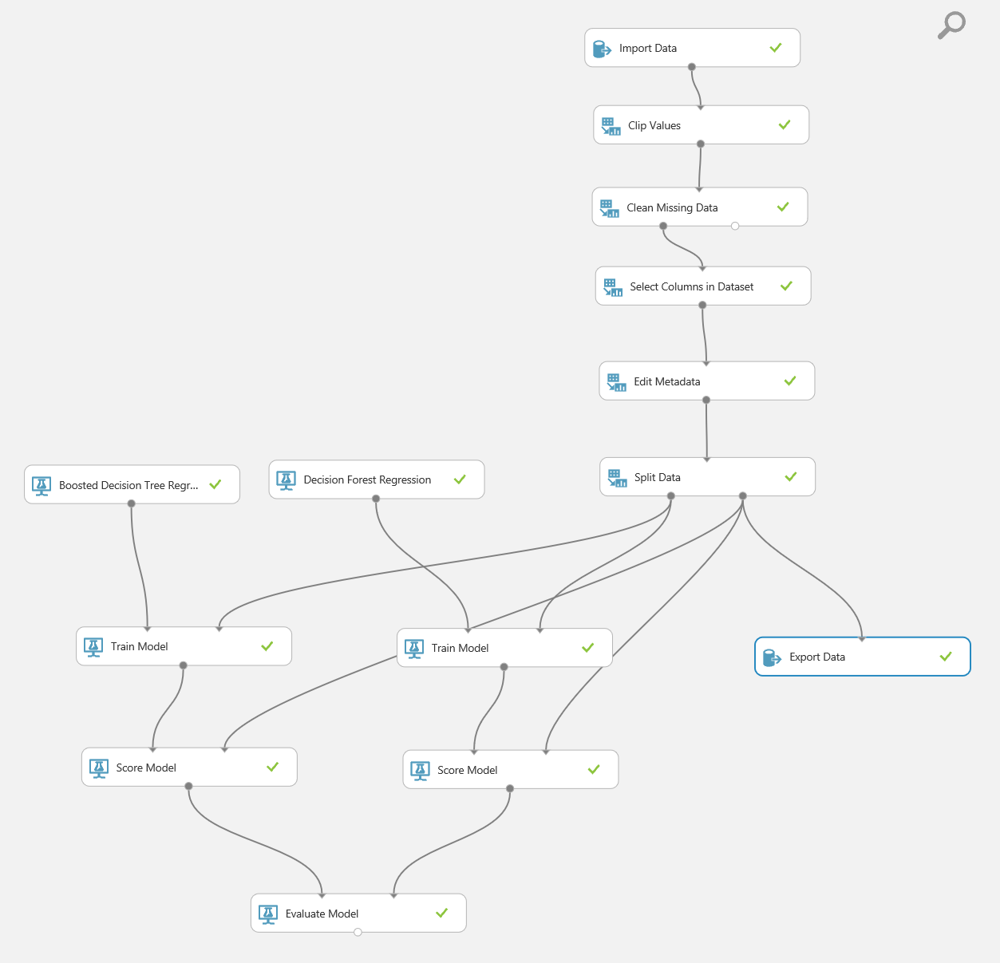
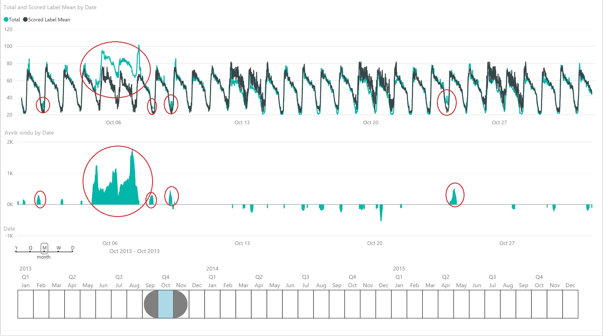
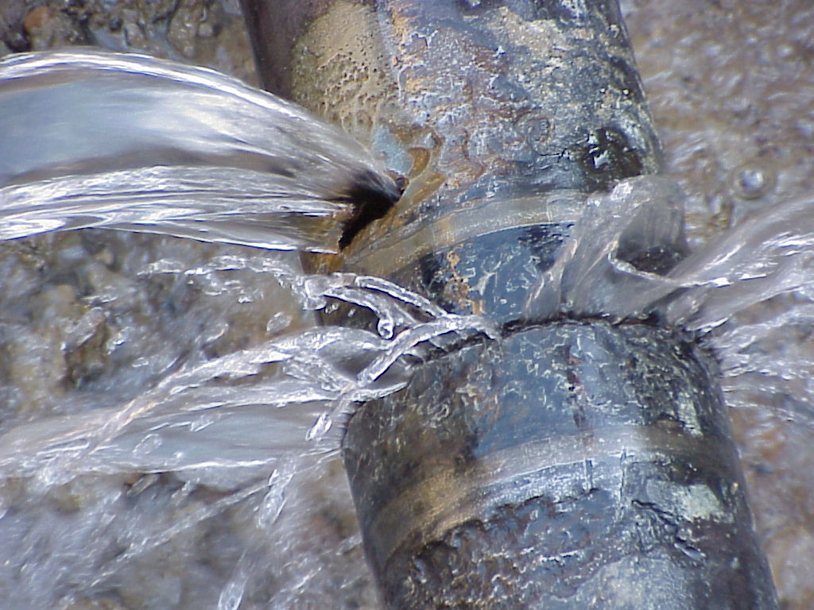

# Using IoT to detect water leakages with Powel 
## Introduction
Municipalities in Norway currently have an average of over 30% water leakage in their water distribution network. This represents a significant cost that ultimately ends up in the hands of the consumers. 
During a week long hackfest together with Microsoft, Powel implemented an IoT solution, ***Smart Water***, that will enhance the maintenance staff with the ability to discover and react to these leakages early. 
This has the potential for huge savings for the municipalities and ultimately the consumers in them.

This document describes the technlogoy choices made, and the learnings made from the hackfest.

*Powel SmartWater Operations Dashboard*



### IoT Technologies used
To achieve this, the following technologies were used: 

- Telemetry provided by SCADA sensors (*Supervisory control and data acquisition*), measuring water flow and pressure
- Azure Functions
- Cortana Intelligence suite
  - IoT Hub for massive-scale ingestion of sensor telemetry
  - Azure Table Storage for storing the telemetry
  - Azure DocumentDb for storing correlated data
  - Azure Machine Learning for doing anomaly detection
- Microsoft PowerBI for visualizing and understanding the data


### Hackfest members

The roles that took part in the hackfest were: 

| Company   | Role                         |
| -------   | ----                         |
| Powel     | Project lead                 | 
|           | Domain expert, water         | 
| BEKK      | ML, IoT Ingestion            |
| Microsoft | Two technical evangelists    | 
 

## Customer Profile

Powel spans Europe with a broad and sustainable customer base and a long history as trusted supplier of software solutions for 
cities / municipalities, counties, the energy industry, as well as the contracting sector. 
Ca USD 50M revenue and 400 employees. The company has offices across Norway as well as in 
Sweden, Denmark, Switzerland, Chile, Turkey and Poland. 
 

## Problem Statement

Water leakages in public water distribution systems are a waste of resources and should be detected and repaired as early as possible.
For Norway as an average one estimates that as much as 32% of the water supply gets wasted due to leakages. 
One major challenge with the water distribution system is the age of the various components in the infrastructure. 
Another challenge is that water pressure today is set to a constant high level, so pipes that are leaking will leak *more* water than necessary. 
The reason why it is set higher is in case of a fire, where firefighters need that extra pressure for their water hoses.

Powel started this journey with the ambition of using the Cortana Intelligence Suite to deliver a product that could help municipalities detect these issues, and engaged with Microsoft
to deliver a working *Minimal Viable Product* (MVP). 

The challenges in the project were: 

- Finding a secure, scaleable way to deliver and store telemetry data
- Understanding how to work and prepare the telemetry data for machine learning (ML)
- Configure Azure ML to do anomaly detection on the data
- Connect the anomaly detection results to the ***Smart Water*** application

## Preparing for the hackfest
A few weeks before the hackfest, we had a full-day discussion where we detailed the activities for the hackfest. Much of the day was spend planning the features for the ***Smart Water*** solution. 
The technologies and architecture in the solution was solidified during this session, and the scoping of what we could achieve within a week was set.

There is also the problem of *locating* water leakages, where in today's solution,special microphones are attached to water pipes, and then used to triangulate an approximate location 
of the leakage source based on their sound wave patterns. These systems are mobile, and only used where leaks are suspected, so we decided to leave this out of the scope of this hackfest.

We also discussed wether regulating water pressure based on predictions would be possible, but decided to leave that as a future exercise.

#### The dataweek
One important decision that was made was to spend a full week, dubbed "The dataweek" between the VSM and the hackfest to gather as much data as possible and to look at different ways to correlate them. 
We wanted to see if traffic conditions, weather, or other external data sources could help us determine water leakages, and to find relevant "third party" sources of interesting data.

We also had the design team start working on sketching the user experience in the Smart Water application to have as much as possible in place for the hackfest itself


During this time, we collaborated using [Slack](https://slack.com/), due to it's informality and effortless cross-domain collaboration. 
Questions, comments and feedback were discussed daily, and made the hackfest the success it was. 

> ***Key learning*** <br />
> Had we not decided to spend time in the dataweek, we would not have been able to do deliver a complete end-to-end solution like we did in this hackfest. 
> Investigating correlations between diffent data was central in the work we did during the hackfest, which mainly revolved around creating a working machine learning model.

*Discussing water grids, elevations, and valves*


 
## Solution 

The ***Smart Water*** solution monitors current water flow into a water distibution system and, in near-real-time, detect anomalies compared to a ML based prediction. 
The operators will then see alerts in their application, together with enough insight to take the approperiate actions. 
The goal, of course, is stopping the leakage as early as possible.
When more sensors and smart water meters are installed, the solution will have a potential to provide even more intelligence. 

> A key part of the solution is the use of Azure Machine Learning. 
> Without this, we would have nothing!

*Smart Water Solution design - overview*



### Data available for analysis 

For this project, we had the following data available:
-	Sensor data for water flow into a few of the water distribution zones in Trondheim municipality. The sensor data had a variety in frequency and time span. 
-   The goal was to have a complete data set for the three previous years (2013 – 2015), but due to issues with sensor availability there were some gaps in the data. 
-	Reports written by the municipality on various incidents / repairs done related to the water distribution system.

*SCADA Sensor*




### Hypothesis 

If we could accurately predict the “normal” water flow into a given zone for the next few hours, we could quickly detect anomalies in the current water flow that would likely be caused by water leakages.

### Process 

To be successful with data analysis and working with Machine Learning models we needed to understand the whole process from the raw data until we had a reasonably good model 
that was ready to be used by the application. 
The process we used is illustrated below. 


### Telemetry Transmission

We were able to obtain 3 years of telemetry from a friendly municipality and in order to create a realistic data stream, 
we wrote a simulator application that replaced the timestamp of that dataset with the current time, and before sending the data to the [Azure IoT Hub](https://azure.microsoft.com/en-us/services/iot-hub/). 
#### Device Simulator
The simulator was written in an [Azure Function](https://azure.microsoft.com/en-us/services/functions/), which limited the transmit frequency to 1 minute. 
The Scada sensors are able to transmit telemetry in 15 second intervals, but will require gateway software to connect to IoT Hub. We do not see any 
major problems in creating such a gateway, and the one minute interval was enough to go ahead

#### Security
The IoT Hub allows only registered devices to communicate with it and each registered device gets its own, "personal" connection string. 
In terms of security, this means that a compromised device's connection string cannot be used to impersonate other devices. 
Additionally, device management in the Azure portal allow devices to be "disconnected" or "muted" in order to stop a faulty device from transmitting data that are 
inconsistent or damaged in any form, which helps prevent mis-readings. Protecting this kind of data is vital to the success of the project, and we found that the 
IoT Hub provided more than adequate solution to our concerns.

#### Storing Telemetry using Stream Analytics job
For all that can be said about the [Azure Stream Analytics](https://azure.microsoft.com/en-us/services/stream-analytics/) service (SA), it was one of the esiest things to deal with during the hackfest. 
Since we already had set up the IoT Hub stream, as well as created a storage account in Azure Storage, we only needed to join the two using the following statement inbetween:

```sql
SELECT * INTO [SmartWaterSimulatorOutput] FROM [SmartWaterSimulatorInput]

SELECT * INTO [ScadaQueue] FROM [SmartWaterSimulatorInput]
```

As you can see, there are **two** statements in here, one takes the data from the IoT Hub stream and stores it directly into Table Storage, and the second takes the same telemetry, 
but outputs it to a [Service Bus Queue](https://docs.microsoft.com/en-us/azure/service-bus/). The idea here, is that the service bus gives the application a near-real-time telemetry
feed of actual values, while the table storage is used by the Machine Learning experiment to do anomaly detection. The **Alert Service** subscribes to the Queue to visualize current values.

### Pre-processing of data files 

The files that were exported from the SCADA system were in Excel format, each representing the water flow for a single sensor. 
Each file contained some Excel tabs with data for different date ranges. Some of the sensor values represented water flowing into a zone and others water flowing out. 
The files also had differences in update intervals, and some even contained sensor data that only reported changes to a previous state, with no predictable frequency at all.

To simplify the processing of this, we created a C# program to pre-process the data by doing the following:
-	Combine different Excel files / tabs for various sensors for a water distribution zone into one consolidated CSV file
-	Calculate the total water flow into a zone by correctly considering the sensors measuring water flowing in / out of a zone
-	Create a uniform frequency for the sensor data by aggregating / distributing values on fixed intervals.
-	Splitting Datetime column into Year, Weekday (Monday, Tuesday, ..., Sunday), Quarter, Month, Hour, FiveMinute (each 24-hour split into 5-minute intervals), Holiday (flag for public holidays).

>**Lessons learned**
>
> This process was not strictly sequential and we had to go back and iterate several times before a good model was achieved.


### Visualizing the data 

Visualization is always a fantastic way to understand data, so we chose [Power BI Desktop](https://powerbi.microsoft.com/en-us/desktop/) to explore the data using various kind of visualizations. 
 This allowed us to quickly look for patterns and get a lot of insight into the data. 
 We identified the fields that we needed to include in the dataset and also what kind of cleaning that needed to be done before we started to experiment with data in machine learning.

 *Data Visualisation in PowerBI*


### Azure ML Studio Experiments 

After having spent some time in Power BI we had learned that the water flow into the water distribution system follows 
a daily pattern with some exceptions of weekends and possibly public holidays. 
To allow for a somewhat granular model for water flow within a 24-hour period, we decided to split every 24-hour into 5-minute intervals. 
We also included a flag to indicate whether a given sample time is associated with a public holiday or not.

We created the following Azure ML Experiment to test various features and machine learning algorithms:

*Azure Machine Learning Experiment*


### Eureka!
Testing with different set of features and machine learning algorithms in Azure ML was very easy! 

To be able to separate noise from real anomalies we experimented a lot with various ways to visualize the residuals between the predicted values and the actual values. 
We decided to go for a model, where we create a sliding windows of residuals. 
In the sliding window, we ignore all the values within one standard deviation of the predicted value. 
Then we calculate the percentage of the difference between the actual value and the predicted value and summed it up over the time window. 
When visualizing the residuals, we also filtered out the low values.

> *Key takeaway* <br/>
> It is very important to use a tool such as PowerBI for visualizing the results of the machine learning!

Image: *Overlaying historical data on top of the Machine Learning prediction*


With this visualization, we could quickly identify anomalies in the water flow values compared with the predicted values. 
We wanted to compare our findings against the history of maintenance reports to see if we could somehow correlate those with the detected anomalies, but this tought us something: 

> **Lesson Learned**
> 
> Trying to correlate time series data from sensors with manually entered maintenance reports is a challenge since they're very loosely coupled with the sensor data.
>
> We therefore decided to keep the manual report data *out* of the machine learning models. 

Even though we decided to skip the manually entered reports in the Machine Learning experiment, we still used them extensively to see and understand the data in Power BI. 
It largely helped us in strengthening our hypothesis that we would be able to build an application to monitor the current actual water flow and trigger alarms based on 
deviations from the predicted curve. 


## Conclusion 

It is nothing short of amazing that during the course of *five days* were able to put together a secure IoT solution where every working part required little effort. 

We were able to create a reasonably good machine learning model to predict future water flow values based on simple inputs like date, time and water flow. 
We were also able to create a good visualization of historical data to highlight the anomalies in our ***Smart Water*** application. 
Correlating anomalies with the manual inspection reports was done in the application. 
We also created an end to end demo application for monitoring and alerting potential water leakages. 
This provided us with enough confidence needed to take this to the next phase.

#### Lessons Learned
- Setting up a secure, scalable IoT system using Azure is a breeze. Azure provides all the required components to host such as system, and in a *proof-of-concept* gone bad, it can just as easilly be taken down again, securing a low investment cost / easy exit.
- The science behind Machine Learning still requires significant knowledge about the problem domain as well as some experience in statistical analysis. Powel is doing the necessary investments to ensure they have this competency in place.
- The architecture and structure in this solution can be applied to many of Powel's other projects

#### Going forward
The next step for Powel is to finish up the last bits and pieces of the application and use this in discussion with customers in order to bring this solution to the market.

An analyst has been introduced to the project to help work with the Machine Learning model further. Together with Microsoft, Powel is making significant investments in aquiring
expertise on data science, ML integration, data analysis and domain expertise.

Further down the line, we will be looking at automating water-pressure in various grids based on machine learning predictions. 
This to provide just enough water pressure based on predictions. 


## References

<dl>
    <dt>A separate, DevOps focused team worked together with Microsoft to implement the <b><i>Smart Water</i></b> application</dt>
    <dd>See '<a href="https://microsoft.github.io/techcasestudies/devops/2016/11/19/Powel.html">Improving water monitoring through DevOps practices with Powel AS</a>' for 
    more details about the solution architecture</dd>
</dl>